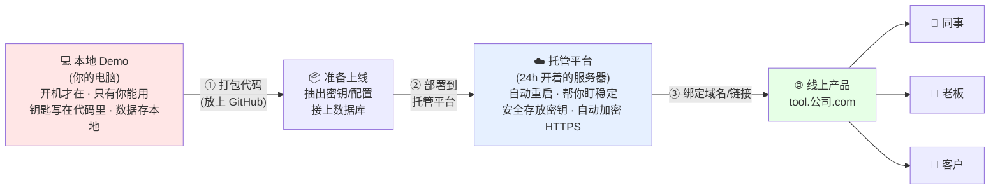

# 模块 3 · 本地 vs 上线——差距在哪

> 时长:60 min | 形式:讲解 | ★主线 | 受众:PM/管理层/BI分析师

---

## 一、本节目标

上午大家用 AI 在自己电脑上做出了一个能跑的小工具,很有成就感。但「在我电脑上能跑」和「别人能用上」之间,其实隔着一道不小的鸿沟。这一节我们要把这道鸿沟拆开看清楚:

- 理解为什么「我这能跑」不等于「上线了」——到底差了哪几样东西。
- 记住上线必须补齐的 5 件事:**让别人能访问、能稳定运行、密钥与配置、数据存储、域名与访问地址**。
- 看懂一张「本地 Demo → 线上产品」的链路图,知道下午动手时每一步在解决什么问题。
- 这一节只讲清「差距是什么、为什么」,具体「怎么做」留到模块 5 动手环节。

一句话:**上午是「在家做饭给自己吃」,这一节告诉你「开餐厅对外营业」还要补什么。**

---

## 二、讲师讲稿

### 2.0 引子:一个尴尬的瞬间(⏱ 5 min)

**讲解要点**:用真实场景制造共鸣,引出核心矛盾。

**讲解词(可照念)**:
「上午大家都做出了自己的小工具,对吧?现在请你做一件事:把这个工具发给你隔壁的同事,让他在他的电脑上打开用一下。……做不到,对吧?要么他打不开,要么你得跑到他工位上、把整套环境在他电脑上重装一遍。这就是今天下午要解决的核心问题——**你做出来的东西,目前只属于你这一台电脑。**」

**类比**:就像你在自家厨房做了一道很好吃的菜。家人能吃到,但马路对面的人吃不到——除非你开一家餐厅。

**互动提问**:「有没有人遇到过:发给别人一个文件,对方说『我打不开』『我这边报错』?其实就是同一类问题。」

---

### 2.1 差距一:让别人能访问——部署/托管(⏱ 12 min)

**讲解要点**:本地程序只在你开机、你运行时才存在;上线意味着把它放到一台「永远开着、所有人都能连上」的公共电脑上。

**讲解词**:
「你的工具现在跑在哪?跑在你的笔记本上。你一合盖、一关程序、一断网,它就没了。而且别人根本连不到你的笔记本——你的电脑没有一个『公开地址』。所以上线的第一件事,就是把程序搬到一台**专门用来对外服务、24 小时开着的电脑上**,这台电脑我们叫『服务器』。把程序搬上去、让它跑起来的这个动作,就叫**部署**;提供这台电脑的服务,叫**托管**。」

**类比**:你家厨房 = 你的笔记本,只服务你自己;餐厅的后厨 = 服务器,开门营业、谁来都能点菜。你不可能让全城人都跑到你家厨房吃饭,所以要租个门面。

**互动提问**:「猜一下,这台『永远开着的电脑』我们要自己买一台放公司机房吗?」(答:不用,有现成的托管平台租,模块 5 会动手用)

---

### 2.2 差距二:稳定运行(⏱ 8 min)

**讲解要点**:自己用时崩了大不了重启;给别人用,半夜崩了、没人发现,就是事故。

**讲解词**:
「自己用的时候,程序卡了你重启一下就行。但上线后是几十上百人在用,它得**一直活着**。万一崩了要能自动重启,得有人知道它崩了。这就是『稳定运行』要操心的事。好消息是:用现成的托管平台,平台会帮你盯着、自动拉起,不用你半夜爬起来。」

**类比**:餐厅营业期间灯不能灭、炉子不能停。自己在家做饭,饿了再开火就行;开门营业,你得保证营业时间里随时有人来都能吃上。

**互动提问**:「如果你的工具是给老板做月度汇报用的,它在汇报前 10 分钟挂了,会发生什么?」

---

### 2.3 差距三:密钥与配置(⏱ 10 min)

**讲解要点**:本地代码里常常直接写着 API Key、密码;上线绝不能这么干,要把这些「钥匙」单独安全存放。

**讲解词**:
「你的工具大概率用到了 AI 的 API Key——这就像一把『付费的钥匙』,谁拿到都能用你的额度花你的钱。上午为了图快,这把钥匙可能直接写在代码里了。在自己电脑上没事,但一上线、代码一公开,等于把家门钥匙贴在大门上。所以上线要做一件事:**把钥匙和密码从代码里抠出来,单独放到一个安全的地方**,这叫『环境变量』或『配置』。代码里只写『去那个安全的地方取钥匙』,而不写钥匙本身。」

**类比**:菜谱可以公开(代码),但保险柜密码不能印在菜谱上(密钥)。

**互动提问**:「如果有人拿到了你的 AI Key,最坏会怎样?」(答:疯狂调用,账单爆掉)

---

### 2.4 差距四:数据存储(⏱ 8 min)

**讲解要点**:本地 Demo 的数据常存在内存或本地文件里,一重启就没;上线要把数据放进真正的数据库,长期、共享、不丢。

**讲解词**:
「你的工具如果让用户填了东西、存了记录,这些数据现在存在哪?很可能存在你电脑的一个文件里,或者程序一关就没了。多人用、要长期保留,就得有个**专门存数据、不会丢、大家共用同一份**的地方——数据库。这样张三填的,李四也能看到;今天填的,明天还在。」

**类比**:自己记账记在便利贴上(本地文件),贴丢了就没了;开店要有一本正经的账本、还得是大家都能查的同一本(数据库)。

**互动提问**:「你们现在做分析,数据是各存各的 Excel,还是有一个共用的数据库?这俩的区别,就是本地和上线的区别。」

---

### 2.5 差距五:域名与访问地址(⏱ 5 min)

**讲解要点**:上线后会有一个公开链接,可以进一步换成「公司自己的、好记的网址」。

**讲解词**:
「东西搬上去之后,平台会给你一个公开链接,比如 `xxx.streamlit.app`,同事点开就能用——这一步就已经『上线』了。再进一步,可以把它换成 `tool.公司.com` 这种自己的、正式的网址,这就涉及域名。这部分细节我们放到模块 5 单独讲,这里你只要知道:**上线后,你的工具有了一个『谁都能输入访问的地址』,而不再是『只在我电脑里』。**」

**类比**:餐厅有了门牌号和店名,客人才能找上门;不能让客人凭你家小区单元号来找你。

---

### 2.6 收束:五件事一张图(⏱ 7 min)

**讲解词**:
「我们把刚才五件事连起来看一张图(见下),你会发现:从『我电脑上能跑』到『别人能用』,本质就是给你的程序补上『能被访问、能一直活、钥匙安全、数据有处放、有个公开地址』这五样。下午动手时,我们会用托管平台,把这五件事**绝大部分交给平台自动搞定**,你真正要操心的没你想得那么多。」

**互动提问**:「现在回头看上午做的工具,这五件事里,你觉得自己最容易忽略哪一件?」

---

## 三、核心图示:本地 Demo → 线上产品的链路

文字说明:左边是「你的电脑(本地)」,只服务你自己;中间经过「打包、配置、部署」三个动作;右边是「托管平台上的线上产品」,补齐了访问、稳定、密钥、数据、地址五件事,最终被任意用户通过一个公开网址访问。

幻灯片做图提示:可简化为「三个色块 + 三个箭头」——红色(本地,只有你)→ 蓝色(托管平台,帮你扛五件事)→ 绿色(线上,人人可用),箭头上标注「打包 / 部署 / 绑域名」。

---

## 四、对照表:本地 vs 上线

| 维度 | 本地 Demo(在家做饭) | 线上产品(开餐厅营业) |
|---|---|---|
| 谁能用 | 只有我自己 | 任何拿到链接的人 |
| 在哪运行 | 我的笔记本 | 24h 开着的服务器/托管平台 |
| 什么时候在 | 我开机、我运行时 | 一直在,永不打烊 |
| 稳定性 | 崩了我重启就行 | 要自动重启、有人监控 |
| API Key/密码 | 常直接写在代码里 | 单独存为环境变量,代码里不出现 |
| 数据存哪 | 本地文件/内存,易丢、不共享 | 数据库,长期保存、多人共用一份 |
| 访问地址 | 没有,别人连不上 | 有公开链接,可换成公司域名 |
| 谁来维护 | 我自己,想关就关 | 要考虑监控、成本、责任人(见模块 6) |

---

## 五、一页速查小结

**核心一句**:从「我电脑上能跑」到「别人能用」,要补 5 件事。

| 差距 | 一句话记忆 |
|---|---|
| ① 让别人能访问(部署/托管) | 把程序搬到一台「永远开着、谁都能连」的电脑上 |
| ② 稳定运行 | 营业时间不能灭灯,崩了要能自动起来 |
| ③ 密钥与配置 | 钥匙别贴在大门上,单独锁进保险柜 |
| ④ 数据存储 | 别记在便利贴,要用大家共用的「账本」(数据库) |
| ⑤ 域名与访问地址 | 给店挂上门牌号和店名,客人才找得到 |

**好消息**:用托管平台,①②③⑤ 大部分平台自动帮你做好,你主要操心「打包代码 + 放好密钥 + 数据存哪」。

---

## 六、讲师备注与易错点

- **本节是「讲清差距」,不是「教操作」**。学员一着急就会问「那具体怎么部署」,统一回答:「下午模块 5 动手做,这一节先建立认知。」避免提前陷入操作细节、拖时间。
- **紧扣上午产出**。多用「你上午做的那个工具」举例,代入感最强。开场最好真让两位学员互相发送工具试一下,失败的瞬间就是最好的教具。
- **比喻要贯穿到底**:「在家做饭 vs 开餐厅」这条主线从头用到尾,五件事都能挂进去(后厨=服务器、营业时间=稳定、保险柜=密钥、账本=数据库、门牌=域名),学员记得牢。
- **不要堆术语**。服务器、部署、托管、环境变量、数据库——每个名词只给「一句话+一个比喻」,不展开技术原理。出现「IP/DNS/反向代理」等词时,明确说「模块 5 专门讲」。
- **密钥安全要重点敲一下**。这是非工程同学最常踩的坑(把 Key 写死在代码、还传上公开仓库),用「账单被刷爆」的后果让大家有痛感。
- **管理层视角加一句**:对业务方/管理层,强调「上线 = 要持续花钱(托管费、API 费)+ 要有人负责维护」,自然过渡到模块 6,避免他们以为「做出来=一劳永逸」。
- **时间控制**:五个差距尽量均匀,别在「数据存储」上讲太深(BI 同学容易聊嗨)。留足 7 分钟讲链路图,因为它是下午动手的总纲。
- **常见误区澄清**:① 「上线就是把文件发给别人」——不是,别人没有你的运行环境;② 「有了公开链接=做完了」——还要管稳定、成本、安全;③ 「数据反正存着了」——本地文件不等于数据库,重启/换机器就可能丢。
