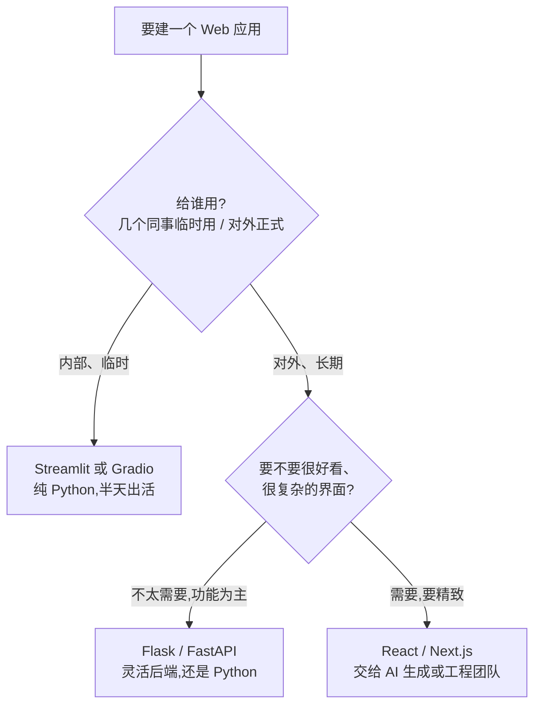

# 模块 4 · Web 应用结构与框架选择

> 时长:60 min | 形式:讲解 + 对比 | 受众:PM/管理层/BI分析师

---

## 一、本节目标

模块 3 我们讲清了「本地能跑」和「别人能用」的差距。这一节回答一个更具体的问题:**你做的这个东西,内部到底由哪几块拼起来?该用哪个框架来搭?**

- 用最朴素的语言理解一个 Web 应用的三层结构:**前端 / 后端 / 数据库**。
- 拿到一张「框架地图」:对会一点 Python 的你来说,哪些工具最省心、哪些先放一放。
- 学会一个选型方法:**先问「给谁用、用多久、要不要好看」,再选框架**,不被名词吓住,也不过度设计。
- 一句话:**这一节让你听到 Streamlit、Flask、React 时不再发懵,还能自己判断「我这个场景该用哪个」。**

---

## 二、讲师讲稿

### 2.1 三层结构:前端 / 后端 / 数据库(⏱ 18 min)

**讲解要点**:任何一个能用的 Web 应用,几乎都能拆成这三块。理解了这三块,后面所有框架名词都能对号入座。

**讲解词(可照念)**:
「我们打开任何一个网站或小工具——比如一个数据看板——其实背后有三个角色在配合。**前端**,就是你眼睛看到的那一层:按钮、表格、图表、输入框,你点哪里、填什么,都是跟前端打交道。**后端**,是你看不到、但在背后干活的那一层:你点了『查询』,是后端去算、去调 AI、去取数据,再把结果送回前端给你看。**数据库**,就是存东西的地方:用户填过的内容、历史记录、要长期保存的数据,都搁这儿。」

**类比(贯穿全节)**:把应用想象成一家**餐厅**——
- **前端 = 前台和餐桌**:顾客看菜单、点菜、上菜,所有「看得见、摸得着」的体验。
- **后端 = 后厨**:接到单子,真正炒菜的地方,顾客看不见,但活儿都在这儿干。
- **数据库 = 仓库/冰箱**:食材、库存、账本,长期存着、随用随取。

「顾客只跟前台打交道,但一道菜端上来,是前台、后厨、仓库三方配合的结果。Web 应用一模一样。」

**互动提问**:「你们平时用的一个内部系统,猜猜:你看到的报表长相是哪一层?点导出后台跑数是哪一层?这些数据存在哪一层?」

---

### 2.2 框架地图:对「会点 Python」的人最省心的选择(⏱ 25 min)

**讲解要点**:框架就是别人写好的「半成品工具箱」,省得你从零造轮子。关键是:**有些框架让你一行前端都不用碰,用纯 Python 就能出活**——这正是为你们准备的。

**讲解词**:
「框架你可以理解成『装修队的成套工具』:你不用自己打铁做锤子,拿现成的就能干活。对你们来说,最大的好消息是——**有一类框架,让你只写 Python,前端那一摊它全帮你包了。**

第一档,最省心:**Streamlit 和 Gradio**。你写几十行 Python,它自动给你变出一个带按钮、表格、图表的网页。几乎不用懂前端,做 Demo、做内部小看板、做 AI 试用页,神器。

第二档,要更灵活的后端:**Flask 和 FastAPI**。当你不只想要一个页面,而是想提供一个『接口』给别的系统调用,或者逻辑比较复杂,就用它们。还是 Python,但要多操一点心。

第三档,要『正经好看的前端』:**React / Next.js**。这是专业前端的主流,能做出非常精致、复杂的界面——但它不是 Python,学习成本高。我的建议是:**真到这一步,要么交给 AI 帮你生成,要么交给工程团队,你自己不必硬啃。**」

**类比**:Streamlit/Gradio = 宜家成品柜,拼一下就能用;Flask/FastAPI = 买板材自己组,灵活但费功夫;React = 请设计师全屋定制,好看但贵且慢。

**互动提问**:「如果你今天就想给三个同事看一个数据小工具,你觉得该从哪一档开始?」(答:第一档,Streamlit/Gradio,够用就好)

---

### 2.3 如何选:别过度设计(⏱ 12 min)

**讲解要点**:选框架不是选「最强的」,是选「最匹配的」。先问场景,再定工具。

**讲解词**:
「很多人一上来就纠结『要不要用最厉害的 React』,结果一个给 5 个人用的内部工具,做了两个月还没上线。这就是**过度设计**。正确顺序是反过来的:**先想清楚给谁用、用多久、要不要好看,再倒推选哪个框架。** 给同事临时用的、Streamlit 半天搞定;要对外、要长期维护、要好看,再往上加码。能用简单的,绝不上复杂的。」

**类比**:去楼下买瓶水,不用开车——选工具也是,匹配需求就好,杀鸡别用牛刀。

**互动提问**:「回想你手上一个真实需求,它到底是『几个人临时用』还是『要对外长期用』?这一句话基本就决定了用哪一档。」

---

## 三、框架对比表

| 框架 | 上手难度 | 适合场景 | 要不要懂前端 | 典型用途 |
|---|---|---|---|---|
| **Streamlit** | ★☆☆☆☆ 极易 | 内部 Demo、数据看板 | 不用,纯 Python | 数据分析小看板、AI 试用页 |
| **Gradio** | ★☆☆☆☆ 极易 | AI 模型演示 | 不用,纯 Python | 让人输入→出结果的 AI 工具 |
| **Flask** | ★★★☆☆ 中等 | 灵活后端、小型网站 | 简单页面要会一点 | 自定义逻辑、对外接口 |
| **FastAPI** | ★★★☆☆ 中等 | 高性能接口服务 | 基本不用(纯接口) | 给其他系统调用的 API |
| **React / Next.js** | ★★★★★ 较难 | 正经、复杂、好看的前端 | 必须懂(非 Python) | 对外正式产品、精致界面 |

> 一句话记忆:**想快=Streamlit/Gradio,想灵活=Flask/FastAPI,想好看=React(交给 AI 或工程团队)。**

---

## 四、选型决策指引

不用记框架,记住先问自己 3 个问题,顺着走就有答案:

**文字版**:
1. **给谁用?** 几个同事内部临时用 → 直接 **Streamlit / Gradio**,不用往下看了。
2. **要长期对外吗?** 要 → 看是不是需要很灵活的后端逻辑或接口 → **Flask / FastAPI**。
3. **要很好看很复杂吗?** 要 → **React / Next.js**,但**交给 AI 帮你写或交给工程团队**,别自己硬啃。

---

## 五、一页速查小结

- **三层结构**:前端(前台/餐桌,你看到的)· 后端(后厨,干活的)· 数据库(仓库,存东西的)。
- **会 Python 的省心顺序**:Streamlit/Gradio → Flask/FastAPI → React/Next.js。
- **想快**用 Streamlit/Gradio;**想灵活**用 Flask/FastAPI;**想好看**用 React(交给 AI 或工程团队)。
- **选型口诀**:先问「**给谁用 · 用多久 · 要不要好看**」,再选框架。
- **核心心法**:能用简单的就别上复杂的,**杜绝过度设计**。

---

## 六、讲师备注与易错点

- **别陷进技术细节**:本节目标是建立认知地图,不是教写代码。学员问「具体怎么写」时,引导到模块 5 动手环节,或答「这正是让 AI 帮你写的部分」。
- **强调省心档**:受众非工程背景,一定要把 Streamlit/Gradio「纯 Python、不碰前端」这一点讲透、讲爽,这是他们最能立刻用上的。
- **React 不要劝退也不要鼓吹**:讲清「它强但不是 Python、成本高」,给出「交给 AI/工程团队」的台阶即可,不必展开。
- **易错澄清**:有人会以为「前端=美工、后端=程序员」——纠正为这是**应用的结构分层**,不是岗位划分;一个 Streamlit 应用里,前后端其实都被框架打包好了。
- **承上启下**:本节选完框架,模块 5 就把选好的东西真正部署上线;可预告「下午我们就用 Streamlit/Gradio 把上午的 Demo 发成公开链接」。
- **时间提醒**:三层结构若讲超时,2.3「如何选」可压缩到 8 min,但决策三问必须保留。
