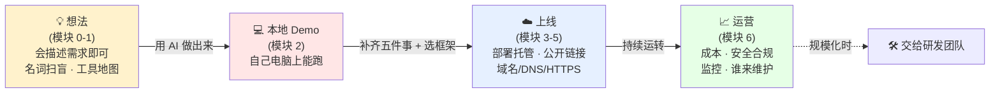

# 模块 7 · 总结 · 案例拆解 · 答疑

> 时长:30 min | 形式:讨论 | 受众:PM/管理层/BI分析师

---

## 一、本节目标

到这里,一整天的内容就跑完了。这一节不再讲新东西,而是做三件事:

- **回顾全链路**:把模块 0–6 串成一条线——从一个「想法」,到电脑上的「本地 Demo」,再到同事点开就能用的「上线产品」,最后到要持续操心的「运营」。
- **拆一个案例**:用一个贴近大家日常的 BI/业务案例,完整走一遍这条链路,让抽象的流程落到一件具体的事情上。
- **自由答疑 + 收需求**:把大家今天积攒的问题聊开,同时收集「下次想深入学什么」,作为后续培训的依据。

一句话:**今天不是终点,是你「能自己做出东西并发布出去」的起点。**

---

## 二、全天回顾:从想法到运营的一条线

一整天我们其实只在回答一个问题:**「一个 AI 帮我做出来的本地小东西,怎么变成别人真正能用的线上产品?」** 把六个模块按这条主线串起来:

- **想法阶段**:模块 0 讲了范式转变——门槛从「会写代码」降到「会描述需求」,你可以亲手做原型,而不只写文档提需求;模块 1 把够用的名词(大模型/提示词/API/Token)和工具地图理清了。
- **本地 Demo**:模块 2 大家动手用 AI 做出了一个在自己电脑上能跑的小工具。
- **上线**:模块 3 讲清「本地能跑 ≠ 别人能用」差在哪五件事;模块 4 讲怎么选框架(会 Python 就先上 Streamlit/Gradio);模块 5 动手把 Demo 部署成有公开链接的应用,并搞定域名/DNS/反向代理。
- **运营**:模块 6 讲上线之后要操心的成本、安全合规、持续维护,以及「什么时候该交给研发团队」。

**幻灯片提示**:全天就这一张总图,横向四个色块 + 一句话,讲师指着图说「你今天已经把前三段亲手走通了」。

---

## 三、案例拆解:一个销售周报看板,从痛点到运营

> 讲师讲解词(可照念,边说边对照上面的全链路图,每讲一步指一下对应色块)

**【背景痛点 — 想法】**
「假设你是销售运营或 BI 分析师。每周一早上,老板要看上周各区域的销售数据。现在的流程是:你从系统导出 Excel,手动做透视表,画几张图,贴进 PPT,发群里。一周一次,每次一两个小时,数据一更新还得重做。这就是一个典型的**业务痛点**:重复、耗时、还容易出错。今天我们要做的,就是把它变成一个**老板自己点开链接就能看的实时看板**。」

**【做出本地 Demo — 模块 1-2】**
「第一步,不写代码,而是**描述需求**:跟 AI 说『帮我用 Python 和 Streamlit 做一个销售看板,读取这个 CSV,按区域筛选,显示销售额趋势折线图和 Top 10 客户表格』。AI 生成代码,你会一点 Python,能看懂、能微调——比如把图表颜色改成公司配色。十几分钟后,在你电脑上 `streamlit run` 一跑,看板就出来了。这就是上午的**本地 Demo**。」

**【上线 — 模块 3-5】**
「但这时候只有你电脑上能看。要给老板用,就得补模块 3 讲的几件事:把数据从『本地 CSV』换成『连公司数据库』(数据存储);把数据库密码从代码里抠出来,放进环境变量(密钥安全);代码传上 GitHub,部署到 Streamlit Cloud(托管),平台自动帮你搞定 24h 运行、自动重启和 HTTPS 加密。最后按模块 5 的方法,在域名后台加一条 CNAME,把那个长链接换成 `sales.公司.com`。现在,老板手机点开就能看实时数据。」

**【运营 — 模块 6】**
「上线不等于结束。要算账:看板本身托管基本免费,但如果接了 AI 做『自动分析摘要』,每次调用要花 API 费,得估个月度上限。要管安全:销售数据是敏感内部数据,要确认合规——能不能传给外部 AI 模型,这是红线。要有人维护:数据源字段变了、有人反馈打不开,谁来修?最后,**当用的人多了、要做权限和复杂报表时,就该把它交给研发团队正式化**——你的价值是快速验证『这个看板有没有用』,而不是长期当运维。」

**收束一句**:「看,从『每周手工做周报的痛』,到『老板自己点链接看实时看板』,你今天学的每一块,在这个案例里都用上了。」

---

## 四、答疑引导 + 需求收集

### 4.1 高频问题预设答案(讲师备查)

| # | 学员常问 | 建议回答(口径) |
|---|---|---|
| 1 | 我不会写代码,真的能自己做出能用的东西吗? | 能。你的核心能力是「描述清需求 + 看懂结果 + 做判断」,代码交给 AI;会一点 Python 让你能微调,更顺手而已。 |
| 2 | AI 生成的代码我看不懂,出问题怎么办? | 把报错原文直接贴回给 AI 让它解释和修复;原型阶段允许「不全懂」,但密钥、数据这类关键处要看明白。 |
| 3 | 把公司数据传给 AI,安全吗? | 这是红线问题。敏感/客户数据是否能传外部模型,要走公司合规确认;不确定就先用脱敏/假数据做原型。 |
| 4 | 上线要花多少钱? | 小工具托管多数有免费额度;主要可变成本是 AI 的 API 调用费,按调用量估算并设上限,别让它「跑爆」。 |
| 5 | 框架到底选哪个? | 先问「给谁用、用多久、要不要好看」。会 Python 又图快,默认 Streamlit/Gradio;要正经前端再考虑 React,或交给 AI 生成。 |
| 6 | 这些东西做出来,会不会很快就坏了/没人管? | 原型由你维护没问题;一旦多人依赖、要长期稳定,就该立项交给研发团队,明确责任人。 |
| 7 | 做出来的东西算谁的?能放公司业务里用吗? | 内部工具走内部流程即可;对外或涉及客户数据时,需 IT/法务确认,不要私自上线生产环境。 |
| 8 | 学完今天,我下一步该练什么? | 把今天的 Demo 真正部署上线一次,完整走通「部署 + 域名」;再挑一个自己的真实痛点重做一遍。 |

### 4.2 后续培训需求小问卷(请学员花 2 分钟填)

1. 今天哪个模块对你**最有用**?哪个**最想再深入**?
2. 你手头有没有一个**真实业务痛点**,想在下一期工作坊里现场做成工具?(请简单描述)
3. 你更希望后续培训偏向:□ 多动手实操 □ 多讲原理 □ 多讲安全合规与成本 □ 行业案例拆解
4. 在「数据合规 / 框架选型 / 成本控制 / 团队协作」中,你最希望公司出一份内部规范的是哪一项?

---

## 五、结业与下一步

恭喜你坚持到这里。一天之前,「上线一个产品」可能还是研发同事黑箱里的事;现在你已经能看懂整条链路,甚至能自己跑通一遍。

**马上能做的三件事**:
- **趁热打铁**:本周内把今天做的 Demo 真正部署上线一次,发给一位同事点开试用——「别人能用上」这一步亲手完成,认知才真正落地。
- **找一个真痛点**:挑一件你每周都在重复做的事(导数、做表、查数据),试着用今天的方法做成一个小工具。
- **把名词速查表、框架决策图、上线 Checklist 收好**,作为以后动手的随身手册。

**推荐学习路径(自选,够用就好)**:
- 想做得更顺:补一点 Python 基础(pandas 处理数据、Streamlit 文档)。
- 想懂得更深:了解 Git/GitHub 基本操作、环境变量与 API 的概念。
- 想往团队协作走:了解前后端三层结构、数据库基础,便于和研发对话。

记住今天的定位:**我们不是要把你变成工程师,而是让你成为「能自己做出原型、能做技术决策、能和研发顺畅协作」的人。** 这件事的门槛,今天已经被你跨过去了。

---

## 六、讲师备注

- **本节是收尾,基调要鼓励、轻松**。不要再灌新知识,重点是让学员产生「我真的能做」的信心,以及「下一步具体干什么」的清晰感。
- **回顾环节别复述**。用全链路图一次串完即可(2-3 分钟),把时间留给案例和答疑。讲案例时不断回指各模块,强化「今天学的都用上了」。
- **案例可换成公司真实场景**。若有贴合业务的统一示例项目(框架待确认第 2 点),优先用它替换「销售周报看板」,代入感更强。
- **答疑要分受众接话**:PM 关心「能不能快速验证想法」,管理层关心「成本/合规/谁负责」,BI 关心「数据怎么连、能不能自动化」。预设答案表按对象灵活取用。
- **合规红线务必当场点明**(对应框架待确认第 3 点):哪些数据不能传外部 AI,最好引用公司已有规定;没有规定的,明确说「先用假数据,上线前走合规」。
- **问卷一定要当场收**(纸质或在线表单),这是后续深化培训立项的核心依据;尤其第 2 题「真实痛点」,可直接作为下一期工作坊的现场素材。
- **时间紧时的取舍**:回顾(3 min)→ 案例(12 min)→ 答疑(12 min)→ 问卷与结业(3 min)。答疑可适当超时,但务必留 2 分钟做正向收尾,别让课程在「还有很多没讲」的焦虑里散场。
